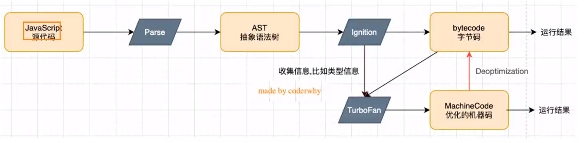

# 浏览器内核和 JS 引擎的关系

以 webkit 为例，它由 WebCore（负责 HTML 解析、布局、渲染等相关工作） 和 JavaScriptCore（解析、执行 JavaScript 代码） 组成。
以 小程序 为例，它由 WebView 和 JsCore 组成

# V8 引擎的原理


可以将 AST 语法树，转换为 ES5 代码，也可以将 AST 语法树通过 Ignition(转换器) 转换为 字节码。
不同系统，CPU 架构不同。很难直接转换成通用的及其指令，所以才将代码转换为 字节码（这些字节码是跨平台的）。
之后执行的时候，V8 引擎会将字节码转换成不同 CPU 架构对应的机器指令。（因为字节码翻译成 CPU 指令，肯定比 AST 语法树翻译成 CPU 指令），之后就可以真正执行了。_但是_ 字节码在运行的过程中 依然需要转换成 汇编代码 去执行 CPU 里面的指令。
**字节码最大的好处就是跨平台**
如果每次字节码都需要先变成对应的汇编指令，再由汇编指令执行对应的机器指令。那你觉不觉得*这个过程是有些耗费性能的*。

#### 那么有没有办法将字节码直接转换为对应平台可以执行的机器指令呢？

直接将 bytecode 变为 对应平台的 0101。那么这样的效率一定是非常高的。
但是我们也要考虑一个问题，如果我的代码只需要执行一次，那么我们有必要把 bytecode 转换为机器代码并保存下来吗？（那就没有必要了，因为这个代码我永远只执行一次）。
但是如果这个代码执行多次，那么我们转为机器代码性能肯定是更高的。
**这也是 V8 引擎的架构的特点**

- V8 引擎里多出来一个叫 TurboFan 的库，这个库可以收集 Ignition 里面的一些执行信息，如果我（TurboFan）发现这个函数（代码）执行频率非常高的话，就会做一个标记，标记成 hot，一旦标记成 hot，就会编程对应优化之后的**机器指令**，那么以后你再执行的话，就会直接执行机器指令。这样性能肯定是提高的。

```javascript
function sum(num1, num2) {
  return num1 + num2;
}

sum(20, 20);
sum(30, 30);
sum("aaa", "bbb");
```

sum 数字，和 sum 字符串，相加做的 是不同的操作，所以对应的机器指令就不同。
前面两次可以使用优化后的机器指令，但是第三次 字符串相加就需要 进行 Deoptimization（反向优化）转换为字节码。
**所以我们在调用某个函数的时候，尽量传递相同类型的参数。这样 v8 引擎会对相应的代码进行优化**
[v8 scanner 词法分析扫描器](https://v8.dev/blog/scanner)
[在线 AST 语法树](http://astexplorer.net)

babel 在将 ts 转换为 js 的时候，
是先将 ts 代码转换为 ast 语法树，然后将 语法树 转换为新的 ast 语法树，之后 generate code 生成 js 代码。

vue template 转为 ast 语法树 之后转为 VNode

---
