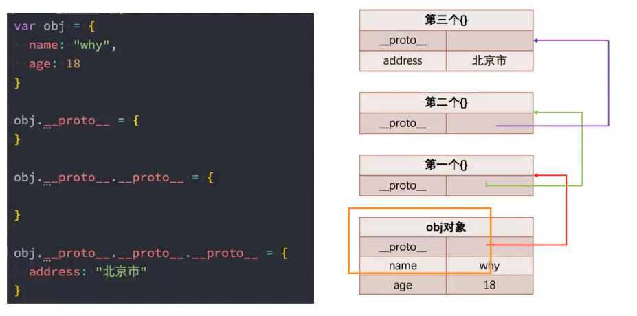

前端真正去做移动端的非常非常少 flutter 就白学了，哈哈哈哈。编程思想都没学到

- React
- 小程序
- Node

---

今天要讲的

1. 原型链
2. 利用原型链实现 js 中的一大特性 **继承**

# JavaScript 中的类和对象（原型链和继承）

当我们编写如下代码的时候，我们会如何来称呼这个 Person 呢？

- 在 JS 中 Person 应该被称之为构造函数；
- 从很多面向对象语言过来的开发者，也习惯称之为类，因为类可以帮助我们创建出来对象 p1、p2；
- 如果从面向对象的编程范式角度来看，Person 确实是可以称之为类的；

```javascript
// 普通函数
function Person() {
  // ...
}

var p1 = new Person();
var p2 = new Person();
```

```java
class Person {};

Person p1 = new Person();
```

ES6 之后的语法

```javascript
let/const
class Person {}

// 需要使用 babel 转换 => 转换成原型、原型链 面向对象封装、继承
```

## 面向对象的特性 - 继承

面向对象的三大特性：封装、继承、多态

- 封装：我们前面将**属性和方法**封装到一个类中，可以称之为封装的过程；

  ```javascript
    function Person { name, age, height, address}
    Person.prototype.running = function(){}
  ```

- 继承：继承是面向对象中非常重要的，不仅仅可以减少重复代码的数量，也是多态前提（纯面向对象中）；
  1. 重复利用一些代码（对代码的复用）
  2. 继承是多态的前提
- 多态：不同的对象在执行时表现出不同的形态；
- 抽象：将现实事物进行抽象

那么继承是做什么的呢？

- 继承可以帮助我们将重复代码和逻辑抽取到父类中，子类直接继承过来使用即可

那么 JS 中如何实现继承呢？

- 我们先看一下 JS 原型链的机制；
- 再利用原型链的机制实现一下继承；

## JavaScript 原型链



### Object 的原型
